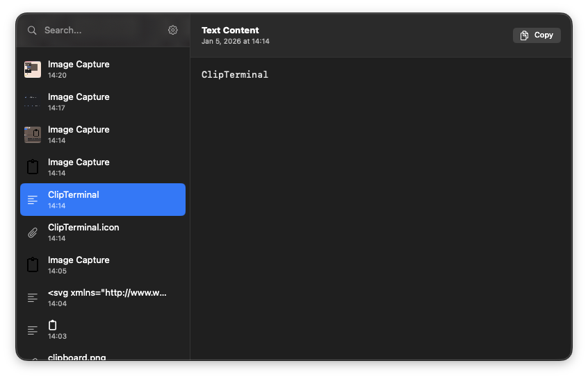

# ClipTerminal

**ClipTerminal** は、macOS 向けのモダンで軽量、かつネイティブなクリップボードマネージャーです。OS の一部のようなシームレスな体験を目指して設計されています。**SwiftUI**で構築され、Apple の最新デザイン言語に準拠し、Spotlight 風のインターフェースでクリップボード履歴を効率的に管理できます。

  

嘘です Gemini 3 Flashです 画像作るのめんどくさい

## 特徴

-   **ネイティブ & モダン UI**: SwiftUI を使用しました
-   **Spotlight 風ワークフロー**:
    -   **グローバルショートカット**: どこからでも `Command + Shift + V` でウィンドウをトグル。
    -   **フローティングウィンドウ**: 画面中央に即座に表示、フォーカスを失うと自動で非表示。
    -   **キーボードファースト**: `↑`、`↓`、`Tab`で快適に移動。`Enter`でコピー・閉じる・（オプションで）ペースト。
-   **リッチコンテンツ対応**:
    -   **テキスト**: 文字数付きでプレーンテキスト履歴を保存。
    -   **画像**: コピーした画像を自動保存し、リストや詳細画面でサムネイル・メタデータ（サイズ・容量）を表示。
    -   **ファイル**: コピーしたファイル参照をフルパスで記録。
-   **永続的な履歴**: クリップボード履歴（最大 100 件）をアプリ再起動後も自動保存。
-   **高度な機能**:
    -   **自動ペースト**: アイテム選択後、`Cmd+V`を自動入力してアクティブアプリに直接貼り付け可能（オプション）。
    -   **ログイン時に起動**: ネイティブトグルで自動起動を設定。
    -   **ステルスモード**: デフォルトでメニューバーエージェントとして動作（Dock 非表示）、Dock 表示の切り替えも可能。

## インストール & ビルド

### 必要条件

-   macOS 26.0 で動作確認済み

### ビルド手順

1. このリポジトリをクローン。
2. Xcode で `ClipTerminal.xcodeproj` を開く。
3. ビルド＆実行（`Cmd + R`）。

## 使い方

1. **アプリ起動**: バックグラウンドで動作。メニューバーのクリップボードアイコンを探してください。
2. **履歴を開く**:
    - メニューバーアイコンをクリック。
    - またはグローバルショートカット **`Command + Shift + V`** を使用。
3. **ナビゲーション**:
    - **検索**: すぐに入力して履歴を絞り込み。
    - **選択**: `↑/↓`や`Tab/Shift+Tab`でリストを移動。
    - **決定**: `Enter`で選択アイテムをクリップボードにコピー。設定で「自動ペースト」有効時はそのまま貼り付けも。
    - **閉じる**: `Esc`でウィンドウを閉じる。
4. **設定**:
    - サイドバーの**ギアアイコン**をクリック、またはメニューバーアイコンを右クリックで環境設定。
    - **ログイン時起動**、**Dock 表示**、**自動ペースト**を設定可能。

## 権限について

**自動ペースト**機能を有効にするには、_システム設定 > プライバシーとセキュリティ > アクセシビリティ_ で ClipTerminal に**アクセシビリティ権限**を付与してください。これによりアプリがキーストローク（`Cmd+V`）をシミュレートできます。

---

_2026 年 1 月 5 日 Gemini Agent 作成_
